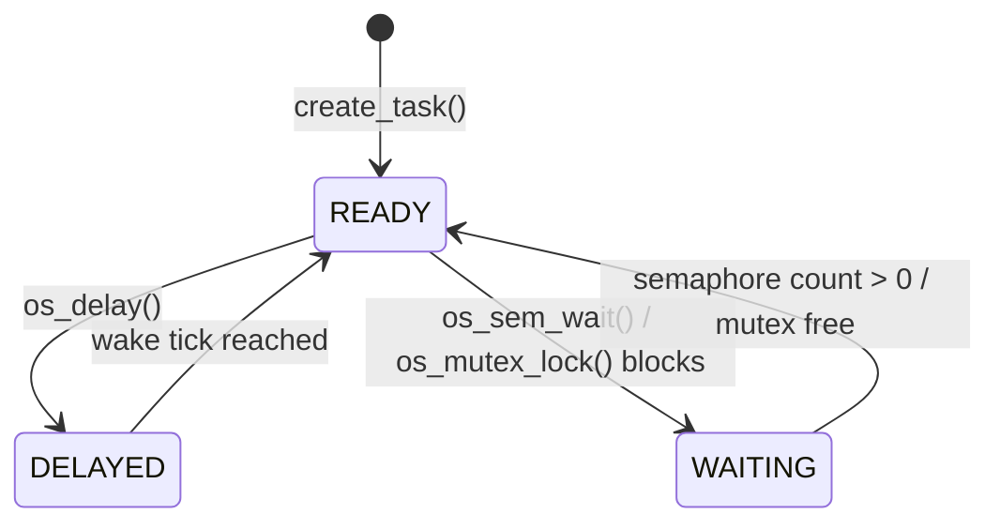

# uno-rtos: a preemptive RTOS from scratch for the Arduino Uno R3


A small preemptive real-time kernel for the ATmega328P (16 MHz, 2 KB SRAM, 32 KB flash), written in C and AVR assembly. It uses no Arduino framework, no FreeRTOS, and needs **no external hardware**: an Uno and a USB cable are enough.

It provides a 1 kHz tick, a priority scheduler, delays, semaphores, a blocking queue, and a **mutex with priority inheritance**. The repo also includes measured numbers for context-switch time, memory footprint, and stack usage, and a side-by-side demonstration of priority inversion with and without inheritance.

> **Scope:** this is a learning kernel built to understand how an RTOS works from the inside. It is not a FreeRTOS replacement. Known limitations are listed [below](#known-limitations).

---

## Results at a glance

| Metric | Result | Conditions |
|---|---|---|
| Context switch (`os_yield()` to first instruction of next task) | **840 cycles (52.5 µs)** | 105 Timer0 counts at clk/8, baseline subtracted; single recorded measurement (commit `c015c5b`) |
| Flash | **2276 B (6.9 % of 32 KB)** | HEAD build, `avr-gcc -Os` |
| SRAM (static) | **1052 B (51.4 % of 2 KB)** | includes 5 task stacks of 160 B each |
| System tick | **1 kHz** | Timer1, CTC, prescaler 64, `OCR1A = 249` |
| Worst observed delay behind a higher-priority busy task | **510 ticks for a 10-tick delay** | priority-3 task spins for about 500 ms (commit `fc53a50`) |
| Tick jitter, no interference | Not measured | only the busy-task stress run was captured |
| Priority inversion | **Reproduced, then prevented** by priority inheritance | see [Demo](#demo-priority-inversion-vs-priority-inheritance) |

The context-switch figure is one recorded measurement, not a min/median/max over many switches. A multi-sample distribution has not been captured yet.

---

## Features

- **Preemptive** scheduling driven by a 1 ms Timer1 tick, plus voluntary `os_yield()`
- **Fixed priorities** (0-255, idle = 0), round-robin among tasks of equal priority
- **`os_delay(ticks)`** using a wrap-safe 16-bit tick comparison
- **Counting/binary semaphores** (blocking `os_sem_wait`)
- **Blocking byte queue** built from two semaphores
- **Mutex with priority inheritance** (single-level)
- **Stack painting** (`0xAA`) with `os_stack_free()` for per-task high-water marks
- Context switch written in **AVR inline assembly**, with a 35-byte saved CPU frame
- Plain `avr-gcc` + `make`; no libraries beyond avr-libc

---

## How it works

### Saved context (35 bytes per task)

Each task has its own stack. When a task is not running, its CPU state sits on that stack, and the TCB stores only the stack pointer.

```
high address  ┌──────────┐
              │ PC low   │  pushed by hardware (interrupt) or CALL
              │ PC high  │
              │ r0       │  ┐
              │ SREG     │  │ pushed by SAVE_CONTEXT
              │ r1       │  │ (r1 is cleared afterwards: avr-gcc expects r1 == 0)
              │ r2 ...   │  │
              │ ... r31  │  ┘
              ├──────────┤
 saved SP ──> │ next free│
low address   └──────────┘
```

New tasks start with a **fake frame** built by `create_task()`: the entry address as PC, `SREG = 0x80` (interrupts enabled), and zeroed registers. The first restore therefore starts the task the same way a normal resume would.

### Tick and context-switch path

```
Timer1 compare match (every 1 ms)
  └─ hardware pushes PC, clears the I flag
      └─ SAVE_CONTEXT        push r0, SREG, r1..r31; store SP in current->sp
          └─ os_tick()        ticks++
          └─ os_schedule()    wake delayed/waiting tasks, pick highest priority
      └─ RESTORE_CONTEXT     load SP from the new current->sp; pop registers
          └─ reti             return into the chosen task
```

`os_yield()` runs the same save / schedule / restore sequence without the timer interrupt and also ends with `reti`. Both paths use the same frame layout, so a task is resumed identically whether it was preempted by the tick or yielded voluntarily.

### Task states



The running task is the READY task selected by `os_schedule()`. The idle task is always READY, so the scheduler always has something to run.

### Scheduler rule

1. Wake DELAYED tasks whose wake time has passed, using `(int16_t)(ticks - wake) >= 0`.
2. Wake WAITING tasks whose semaphore count is nonzero or whose mutex is free.
3. Find the highest priority among READY tasks.
4. Starting after the current task, run the next READY task at that priority (round-robin among equals).

### Priority inheritance

When a task blocks on a mutex held by a lower-priority owner, the owner's effective priority is raised to the waiting task's priority.

```
LOW (priority 1) owns the mutex
        ↓
HIGH (priority 3) blocks on the mutex
        ↓
LOW temporarily runs at priority 3
        ↓
MEDIUM (priority 2) cannot preempt LOW
        ↓
LOW releases the mutex and returns to priority 1
        ↓
HIGH acquires the mutex
```

This prevents the classic inversion shown by the plain-lock demo below.

---

## API

| Function | Purpose |
|---|---|
| `create_task(fn, prio)` | Create a task; priority 1-255 (0 is the idle task) |
| `os_schedule()` + `start_first()` | Select the first task and start the kernel; `start_first()` does not return |
| `os_yield()` | Give up the CPU voluntarily |
| `os_delay(ticks)` | Sleep for `ticks` milliseconds (maximum 32767) |
| `os_sem_init(s, n)` / `os_sem_wait(s)` / `os_sem_post(s)` | Counting semaphore |
| `os_mutex_init(m)` / `os_mutex_lock(m)` / `os_mutex_unlock(m)` | Priority-inheritance mutex |
| `os_queue_init(q)` / `os_queue_put(q, v)` / `os_queue_get(q)` | Blocking byte queue (`QUEUE_LEN = 8`) |
| `os_stack_free(i)` | Bytes never touched in task `i`'s stack |

Compile-time limits: `MAX_TASKS = 5` (including idle), `STACK_SIZE = 160` bytes per task.

Minimal example:

```c
static void blink(void)
{
    DDRB |= _BV(PB5);
    for (;;)
    {
        PINB = _BV(PB5);      // toggle pin 13
        os_delay(500);
    }
}

int main(void)
{
    uart_init();

    create_task(idle_task, 0);
    create_task(blink, 1);

    os_schedule();
    timer1_init();

    start_first();            // do NOT call sei(): the fake frame's SREG enables interrupts
}
```

---

## Build and flash

Requires Linux (Ubuntu tested), `avr-gcc`, `avr-libc`, `avrdude`, and `make`.

```bash
sudo apt install gcc-avr avr-libc avrdude make
make                           # builds main.hex and prints flash/SRAM use
make flash PORT=/dev/ttyACM0   # some boards appear as /dev/ttyUSB0
screen /dev/ttyACM0 115200     # serial output; exit with Ctrl-A, K, Y
```

If access to the serial device is denied, add your user to the `dialout` group and log out and in again.

---

## Demo: priority inversion vs priority inheritance

Three tasks: LOW = priority 1, MEDIUM = priority 2, HIGH = priority 3. LOW takes a shared lock and does work, HIGH then tries to take it, and MEDIUM is CPU-bound.

**Plain lock (no inheritance): priority inversion.** MEDIUM runs while HIGH is blocked behind LOW (commit `25968f8`):

```
LOW: starting
LOW: trying to acquire lock
LOW: acquired lock
HIGH: trying to acquire lock
MEDIUM: running              <-- lower priority than HIGH, yet it runs first
LOW: releasing lock
HIGH: acquired lock
```

**Inheritance mutex.** LOW is boosted to priority 3 while HIGH waits, so MEDIUM cannot preempt it (commit `b59dfdd`):

```
LOW: starting
LOW: trying to acquire mutex
LOW: acquired mutex
HIGH: trying to acquire mutex
LOW: releasing mutex
HIGH: acquired mutex         <-- HIGH gets the lock before MEDIUM runs
MEDIUM: running
LOW: priority restored
```

After the unlock, LOW's effective priority returns to its base priority of 1.

---

## Measurements

### Context-switch time (commit `c015c5b`)

**Method:** Timer0 runs free at clk/8, so 1 count = 0.5 µs = 8 CPU cycles. Task A reads `TCNT0` and calls `os_yield()`; task B reads `TCNT0` as its first action. The difference, minus a baseline of two back-to-back `TCNT0` reads, is the latency.

**Result:**

```
105 counts x 8 = 840 cycles
840 cycles / 16 MHz = 52.5 µs
```

This covers the full yield-to-resume path, including the scheduler's passes over the task table, so it grows with the number of tasks. It is a single recorded measurement; a min/median/max over many switches has not been captured.

### Memory (HEAD build)

| Resource | Bytes | % of device |
|---|---:|---:|
| Flash | 2276 | 6.9 |
| SRAM (static) | 1052 | 51.4 |

Most of the SRAM is the five task stacks: 5 × 160 = 800 bytes.

### Stack usage (`STACK_SIZE = 160`, Step 10c build with idle/blink/producer/consumer/stats)

Stacks are painted with `0xAA` at task creation; `os_stack_free()` counts the untouched bytes.

| Task | Free (B) | Used (B) |
|---|---:|---:|
| idle | 116 | 44 |
| blink | 114 | 46 |
| producer | 114 | 46 |
| consumer | 106 | 54 |
| stats | 109 | 51 |

The largest observed usage was 54 bytes, leaving 106 free. These are **observed high-water marks from one run, not proven worst-case bounds.** Idle's 44 bytes is essentially the interrupt path itself (the 35-byte frame plus the call into the scheduler), so a safe sizing rule is: *stack needed ≥ deepest call chain + 44 bytes*.

### Tick behaviour (commit `fc53a50`)

The system tick is 1 ms. A task repeatedly called `os_delay(10)` for 1000 samples. About 200 ms after boot, a higher-priority task (priority 3) ran a busy loop for roughly 500 ms. That window delayed one sample; the others were unaffected.

```
samples   = 1000
min delta = 10 ticks
max delta = 510 ticks
```

The extra 500 ticks matches the time the higher-priority task held the CPU, which confirms that a lower-priority task cannot run while a higher-priority task stays runnable.

Not measured: a baseline run with no competing busy task, and sub-millisecond wake latency. No no-interference jitter number is claimed here.

---

## Design decisions

- **Naked ISR and `os_yield()`.** The compiler must not generate its own prologue/epilogue, because the stack pointer is saved and swapped inside the routine.
- **`reti` ends both the tick ISR and `os_yield()`.** Both leave the same 35-byte frame, so one restore sequence serves both. A side effect: a resumed task always runs with interrupts enabled, so code that must stay atomic uses `cli()`/`sei()` explicitly.
- **`start_first()` ends with `ret`.** The first dispatch restores the fake frame (including `SREG = 0x80`) and returns into the first task's entry address.
- **`r1` is cleared after saving.** avr-gcc treats `r1` as the zero register, so the switch code saves it and then clears it.
- **`SREG` is saved before `cli`.** Capturing it first preserves the interrupt flag of the interrupted code.
- **No `sei()` in `main()`.** An early `sei()` could let the Timer1 tick fire before the first task context is loaded, corrupting the first switch. The fake frame's `SREG = 0x80` enables interrupts at the right moment.
- **Signed tick comparison.** `(int16_t)(ticks - wake) >= 0` stays correct when the 16-bit tick counter wraps, for delays up to 32767 ticks.

---

## Known limitations

- The scheduler scans the whole task table on every reschedule (O(n)); there are no per-object wait queues.
- `os_sem_post()` does not preempt immediately; a higher-priority waiter runs at the next tick or yield.
- Priority inheritance is single-level: there is no chained (transitive) inheritance, and unlock restores the base priority even if the task still holds another mutex.
- Recursive locking is not supported: a recursive `os_mutex_lock()` returns without acquiring the lock.
- `os_mutex_unlock()` always yields, even when nobody is waiting.
- No stack-overflow protection beyond paint-and-measure; the ATmega328P has no MPU.
- Tasks must not return from their entry function.
- Blocking primitives and the UART print helpers must not be called from an ISR.
- Maximum of 5 tasks, including idle.

---

## Roadmap

- [ ] Single-pass scheduler / ready flags, then re-measure context-switch time against the 840-cycle baseline
- [ ] No-interference tick-jitter baseline
- [ ] Multi-sample context-switch distribution (min / median / max)
- [ ] Sub-millisecond wake latency using a hardware timer
- [ ] Static stack analysis with `-fstack-usage`, then right-size `STACK_SIZE`
- [ ] Software timers
- [ ] Tickless idle
- [ ] Comparison against FreeRTOS on the same hardware and demo

---

## Repository layout

```
.
├── main.c       kernel, scheduler, context switch, synchronization, demo
├── Makefile
├── README.md
└── LICENSE
```

The commit history follows the build order, with one commit per step from the bare-metal blink (Step 0) through the priority-inheritance mutex (Step 11).

---

## References

- Microchip, *ATmega328P Datasheet*
- Microchip, *AVR Instruction Set Manual*
- avr-libc documentation
- GCC / AVR-GCC documentation


## License

MIT (see `LICENSE`).
